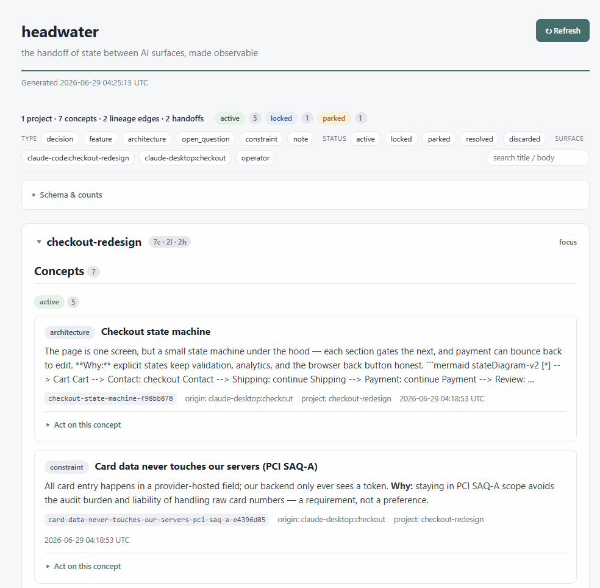

# headwater

A local-first tool that records and makes observable the **handoff of state between AI surfaces** —
a Claude Desktop chat, a Claude Code session, other agents.

Memory tools remember *what was learned*. headwater models *how it moves*: the concepts that flow
between surfaces, where they came from (lineage), and the handoffs that carry them.

This is **v1** — the smallest thing that closes one real loop:
**write a concept → recall it → fork it → hand it off → return the handoff**, all observable in a local viewer.

## Demo



One command seeds a disposable, repo-local pool (`.demo/`, git-ignored — **never your real pool**) with a
small *checkout redesign* moving between a planning chat and a coding session, then serves the page:

```sh
bun install
bun run demo          # seed .demo/ with the example (wipes + repopulates, so re-running is safe)
bun run demo:serve    # live viewer — open the printed http://127.0.0.1:8765
```

What to look at:

- **Lineage tree** — the locked root checkout decision with a **supersede** branch (a refined version; the
  original stays the canonical root) and a separate **operator annotation**: immutability-by-fork, made visible.
- **Handoff timeline** — one **returned** loop (planning → code, implemented) and one **pending** loop (an
  open product question awaiting a call).
- **Rich bodies** — expand *Checkout state machine* for a rendered **Mermaid** diagram; the payment decision
  carries a **pipe table**.
- **Type × status matrix** — fills in across decisions, architecture, a constraint, and a parked question.

## Stack

TypeScript on **Bun** (package manager + runtime; no build step). The only runtime dependencies are the
official **MCP TypeScript SDK** and **zod**. Everything else is a Bun built-in: `bun:sqlite` for the pool,
`bun:test` for tests, `Bun.write` + template literals for the observation page. The live viewer renders
rich concept bodies and `mermaid` diagrams via one **vendored** static asset — Mermaid v11.15.0
(`vendor/mermaid.min.js`, MIT; see `vendor/mermaid.LICENSE`) served only to the browser — so the two
runtime dependencies are unchanged.

## Install

```sh
bun install
```

## Data

One authoritative SQLite pool, stored **outside the repo**:

- Default: `~/.workspace/pool.db`
- Override the directory with the `HEADWATER_DATA_DIR` environment variable.

The repo holds code only — the pool, `*.db`, and the generated `index.html` are git-ignored.

### Model (six tables)

`project`, `surface`, `concept`, `lineage`, `handoff`, `handoff_concept`.

Key invariants: **concepts are immutable** (a fork is a new row plus a lineage edge — the original is never
touched), **lineage is append-only** (child → parent edges; the original is the canonical root), and a
handoff's `payload_snapshot` + `directive` are **frozen at creation** (only its status/return fields move).
These are enforced **at the substrate** by SQLite triggers — a raw `sqlite3 pool.db "UPDATE …"` is rejected
too, not just the tool paths — so the integrity claim holds of the file itself.

## MCP tools (six)

| Tool | What it does |
| --- | --- |
| `write_concept` | Create a new immutable concept (origin = the calling surface). |
| `fork_concept` | Create a new concept from a parent + a lineage edge new→parent. Original untouched. |
| `read_concept` | Recall a concept by id (first-class path). |
| `read_project_state` | Session-kickoff context: concepts by status, pending handoffs, recents. |
| `open_handoff` | Open a `pending` handoff carrying named concepts (frozen JSON snapshot). |
| `return_handoff` | Mark a handoff `returned` with a return note. |

## Usage

```sh
bun run start    # start the MCP server (stdio transport)
bun run render   # read the pool and write a static ./index.html
bun run serve    # live viewer at http://127.0.0.1:8765 — read + write, re-renders from the pool per request
bun test         # run the test suite (the end-to-end loop + the viewer)
```

Observe concepts (grouped by status), the lineage tree, and the handoff timeline two ways:

- **Static** — `bun run render` writes a read-only `index.html` snapshot (pure HTML/CSS, no forms).
- **Live** — `bun run serve` starts a local viewer that re-renders from the pool on every request
  (a **Refresh** button reloads it; override the port with `HEADWATER_VIEW_PORT`).

### The live viewer

The live viewer is **read + write**, and richer than the static snapshot:

- **Rich concept bodies** — a body renders an escape-first markdown subset (headings, bold/italic/`code`,
  http(s) links + images, pipe tables, bullet/numbered lists, `- [ ]`/`- [x]` checklists) plus `mermaid`
  diagrams (rendered client-side by the vendored bundle; the static snapshot shows the source as a code
  block). `[[concept-id]]` citations resolve to in-page links — a dangling citation renders as a ghost.
- **The handoff is the interaction target** — each handoff on the timeline expands in place to its
  evidence: the frozen payload beside each carried concept's *current* node with a computed drift
  verdict, and the return note (or the open loop's ghost). Lineage is one tree; a pending handoff
  hangs a dashed "expected return" ghost branch off what it carries.
- **Browse & filter** — faceted filters by type/status/surface and a plain substring search (`?q=`).
- **Write actions** — comment (an `annotates` fork), fork, and open/return a handoff straight from a
  card. A comment is a fork, never an edit, so concept immutability still holds; the static snapshot
  stays form-free.

## Scope (v1)

Deliberately small. **Not** included: full-text/semantic recall, auth/multi-user/teams, cloud/sync,
automatic cross-reference discovery, graph-visualization libraries, or orchestration. See `CLAUDE.md`
for the full architecture and scope fence.

## How to connect

headwater is a **stdio** MCP server launched with `bun run`. Point your client at the entry file by
**absolute path** (so it works regardless of the client's working directory). The pool lives at
`~/.workspace/pool.db` no matter where the server is started; set `HEADWATER_DATA_DIR` to relocate it.

### Claude Desktop

Edit `claude_desktop_config.json` (Settings → Developer → Edit Config) and add:

```json
{
  "mcpServers": {
    "headwater": {
      "command": "bun",
      "args": ["run", "/absolute/path/to/headwater/src/index.ts"]
    }
  }
}
```

Replace `/absolute/path/to/headwater` with the absolute path to your clone. On Windows, use an escaped
absolute path, e.g. `"args": ["run", "C:\\Users\\you\\headwater\\src\\index.ts"]`. To relocate the pool,
add `"env": { "HEADWATER_DATA_DIR": "/custom/path" }`. Restart Claude Desktop to pick up the change.

### Claude Code

Add it from the repo root with the CLI (the `--` separates headwater's launch command):

```sh
claude mcp add headwater -- bun run /absolute/path/to/headwater/src/index.ts
```

Replace `/absolute/path/to/headwater` with the absolute path to your clone (a Windows absolute path on
Windows). Equivalently, commit a project-scoped `.mcp.json` with the same shape as the Claude Desktop
snippet above. Override the pool location with `--env HEADWATER_DATA_DIR=/custom/path`. Verify with
`claude mcp list`.

> For local development from the repo root, `bun run start` launches the same server.

### Regenerate the observation page

```sh
bun run render   # reads the pool and (re)writes ./index.html — open it in a browser
```

## Security

headwater is **local-first and single-user**. The live viewer binds to **`127.0.0.1`** only and is
**unauthenticated by design** in v1 — it is meant for the operator on their own machine, not a shared
host or the network. With that boundary:

- Concept bodies render **escape-first**: text is HTML-escaped first, then a fixed whitelist of tags is
  reintroduced. Images and links are accepted only with `http(s)` URLs — no raw HTML, `javascript:`, or
  `data:` URLs reach the page, and the vendored Mermaid runs with `securityLevel: 'strict'`.
- Write actions are `POST`-only with a 303 redirect (a refresh never re-submits). The viewer answers
  **only loopback Hosts** (a DNS-rebinding defense), and a cross-site `POST` is additionally rejected via
  `Sec-Fetch-Site`.
- **Immutability is enforced at the substrate**: SQLite triggers reject any `UPDATE`/`DELETE` that would
  rewrite a concept, a lineage edge, or a handoff's frozen fields — so tampering fails even outside the
  tools.
- The pool lives outside the repo and all SQLite files are git-ignored, so data never lands in version
  control.

Do **not** expose the viewer to an untrusted network or multiple users — auth/multi-user/cloud is
explicitly out of v1 scope. See `CLAUDE.md` for the full posture.

## License

MIT © 2026 YKnowMe
