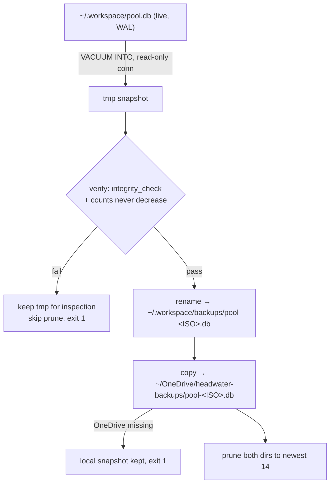

# Design — Backing up the operational pool

**Date:** 2026-07-09
**Status:** Proposed — decisions settled with the operator; awaiting spec review, then implementation
**Closes:** open_question `backup-strategy-for-the-operational-pool-unresolved-naive-cp-pool-db-is-unsafe-6febb110`

## Problem

The pool is the single source of truth and lives outside the repo at `~/.workspace/pool.db`
(`HEADWATER_DATA_DIR` overrides). It is deliberately gitignored (`*.db`, `*.db-shm`, `*.db-wal`,
`.workspace/`). Git replicates the code; nothing replicates the pool. Today it holds 126 concepts
across three projects (`threadkey` 82, `headwater` 42, `vendorprobe` 2), the full lineage tree, and
10 handoffs — on exactly one disk.

The operator has been hand-copying the file before risky operations
(`pool.backup-before-lockclock-merge-2026-07-07.db`). The instinct is right; the mechanism is unsafe.

### The hazard, measured

`initDb` sets `PRAGMA journal_mode = WAL` (`src/db.ts:252`). Committed transactions live in the WAL
until a checkpoint folds them into the main file. At the time of writing the WAL was 4.1 MB against a
600 KB database. Measured against the live pool:

| Method | concepts | handoffs | `integrity_check` |
| --- | --- | --- | --- |
| `VACUUM INTO` (read-only conn) | **126** | **10** | `ok` |
| naive `cp pool.db` | 119 | 9 | opens without error |

A plain copy silently loses 7 concepts and a whole handoff, and the result passes as valid. Copying
`pool.db` + `-wal` + `-shm` together while `bun run serve` holds them open can additionally capture
them mid-write and tear.

**The mechanism is a design question, not a scheduling detail.**

## Threat model

Both failure classes are in scope (operator decision):

- **A — fat-finger / bad state.** A wrong write, a botched merge, schema surgery gone sideways.
  Requires *versioned history*.
- **B — dead disk / lost machine.** Requires an *off-machine* copy.

## Decisions

1. **Snapshot with `VACUUM INTO` over a read-only connection.**
   Empirically verified against the live pool: consistent (WAL folded in), 29 ms, `integrity_check`
   clean. A read-write connection *failed outright* (`SQLITE_MISUSE`), so the safe mode is the only
   mode that works — the script structurally cannot write to the pool. Output is a standalone
   database file: no `-wal`, no `-shm`, nothing to reassemble on restore.

2. **Off-machine copy goes to `~/OneDrive/headwater-backups/`.**
   Zero new tooling, already syncing. Accepted cost, explicitly: the full cross-project pool
   (`threadkey`, `headwater`, `vendorprobe`) lives in Microsoft's cloud. The "local-first, no cloud,
   no sync" posture is a *product* stance about headwater's surfaces; operator backup ops are not the
   product. Encryption-at-rest before upload was offered and declined for v1.

3. **Trigger: a daily Windows scheduled task**, invoking the same `bun run backup` script.
   Rejected: a `Stop` hook. It fires only in Claude Code, but the pool is also written from Claude
   Desktop and from the live viewer's comment/fork/handoff forms. A backup that silently skips two of
   three write surfaces fails at the worst moment. Rejected: manual-only — it runs when you are
   already nervous, which is the wrong time to start.

4. **The script lives in the repo at `scripts/backup.ts`.**
   The closed file list in `CLAUDE.md` enumerates `src/`, `tests/`, `vendor/`; `scripts/seed-demo.ts`
   already sits outside it, so `scripts/` is precedent rather than a breach. No new runtime
   dependencies — `bun:sqlite` and `node:fs` are Bun built-ins, so the two-deps rule is untouched.
   An operator-side script outside the repo was rejected: unversioned, unreviewed, and it dies with
   the machine — the exact failure being defended against.

5. **Restore is documented, not scripted.** See below.

## Design

### Components

One script, `scripts/backup.ts`, exporting testable functions and a `main()`. It reuses
`resolveDbPath()` from `src/db.ts` rather than duplicating path resolution.

| Unit | Does | Depends on |
| --- | --- | --- |
| `snapshot(src, destTmp)` | `VACUUM INTO` over a read-only connection | `bun:sqlite` |
| `verify(snapshotPath, prev)` | `integrity_check` + monotonic row-count tripwire | `bun:sqlite` |
| `publish(tmp, final)` | atomic rename into place | `node:fs` |
| `prune(dir, keep)` | delete all but the `keep` newest, never the newest | `node:fs` |
| `main()` | sequences the above; exit codes | the above |

### Data flow



### Verification — the tripwire

A backup that is never checked is a rumor. Each snapshot is opened and checked before acceptance:

1. `PRAGMA integrity_check` must return `ok`.
2. **Monotonic row counts.** Concepts are immutable, `lineage` and `handoff_concept` are append-only,
   and the schema-v2 triggers reject every DELETE. Therefore `count(concept)`, `count(lineage)` and
   `count(handoff)` can never decrease between snapshots. A decrease means corruption, truncation, or
   the wrong source file.

On failure: retain the suspect snapshot, **skip pruning entirely**, exit non-zero.

This invariant is available only because of the immutability posture — it is a free, strong integrity
signal that most SQLite backups cannot offer.

### Naming, retention, atomicity

- Filename `pool-<ISO-8601 UTC, colons→dashes>.db`, e.g. `pool-2026-07-09T05-19-53Z.db`.
- Keep the newest **14** in each destination (~660 KB each, ~18 MB total). Never prune the newest;
  never prune when verification failed.
- Every write goes to a `.tmp` name and is renamed into place, so an interrupted run can never leave a
  half-written file that looks like a good backup.
- Overrides: `HEADWATER_DATA_DIR` (source, existing), `HEADWATER_BACKUP_DIR` (offsite destination),
  `HEADWATER_BACKUP_KEEP` (retention count). The overrides exist chiefly so tests can point at temp
  directories.

### Error handling

| Condition | Behaviour |
| --- | --- |
| `integrity_check` ≠ `ok` | keep tmp, no prune, exit 1 |
| row count decreased vs. newest existing snapshot | keep tmp, no prune, exit 1 |
| offsite dir missing/unwritable | local snapshot published, no offsite prune, exit 1 |
| source pool absent | exit 1, nothing written |

Half of "both" is not "both": a missing offsite destination is an error, not a warning to swallow.
Logs go to stderr.

### Trigger

```
schtasks /Create /TN "headwater-backup" /F /SC DAILY /ST 09:00 /RL LIMITED ^
  /TR "\"C:\Users\karim\.bun\bin\bun.exe\" run \"D:\Repository\headwater\scripts\backup.ts\""
```

Invoked by absolute path so it does not depend on the working directory. `package.json` also gains
`"backup": "bun run scripts/backup.ts"` for manual runs.

**Known limitation:** if the machine is asleep at 09:00 the run is skipped. `schtasks` cannot set
"run task as soon as possible after a missed start"; enable it once via the Task Scheduler GUI
(task → Settings) or an XML import.

## Restore (documented procedure)

A snapshot is a complete standalone database, so restore is a copy — with one footgun. **If a stale
`pool.db-wal` sits beside the restored file, SQLite replays it on next open** and silently
reintroduces the state you were escaping.

1. Stop every writer: `bun run serve`, and every MCP client (Claude Code, Claude Desktop).
2. Move the current pool aside: `mv ~/.workspace/pool.db ~/.workspace/pool.db.pre-restore`
3. **Delete `~/.workspace/pool.db-wal` and `~/.workspace/pool.db-shm`.** Not optional.
4. Copy the chosen snapshot to `~/.workspace/pool.db`.
5. Verify: open read-only and confirm `PRAGMA integrity_check` returns `ok` and the row counts look
   right.
6. Restart `serve` / clients.

Not scripted, deliberately: restore is rare and dangerous, and step 1 is something no script can
verify — it cannot tell whether a writer is still attached. Four careful lines read by a human beat a
script that corrupts the pool it is restoring.

## Testing

`tests/backup.test.ts` (new file; `bun:test`, temp dirs throughout, never touching the real pool).
Written test-first, matching the repo's existing TDD practice.

- A snapshot captures rows that are committed but **not yet checkpointed** into the main file — the
  regression test for the actual bug. Assert the snapshot's counts match the live connection's, and
  that a bare `cp` of the main file alone does not.
- Snapshot passes `integrity_check`.
- The source pool is unmodified by a backup run (connection is read-only).
- `verify` rejects a snapshot whose concept/lineage/handoff counts decreased; the run exits non-zero
  and prunes nothing.
- `prune` keeps exactly the newest N and never deletes the newest.
- A missing offsite directory publishes the local snapshot and exits non-zero.
- A successful run leaves no `.tmp` files behind.

## Out of scope

- **WAL not checkpointing.** The 4.1 MB WAL is almost certainly the long-lived `serve` reader holding
  back checkpoints. Harmless for correctness and irrelevant once `VACUUM INTO` is used. Noted, not
  addressed here.
- Encryption before upload (offered, declined for v1).
- A restore script.
- Any change to the six MCP tools, the schema, or the viewer.

## Files touched

- `scripts/backup.ts` — new
- `tests/backup.test.ts` — new
- `package.json` — add the `backup` script
- `CLAUDE.md` — one line recording the `scripts/backup.ts` addition and the OneDrive carve-out
- `README.md` — the restore procedure
